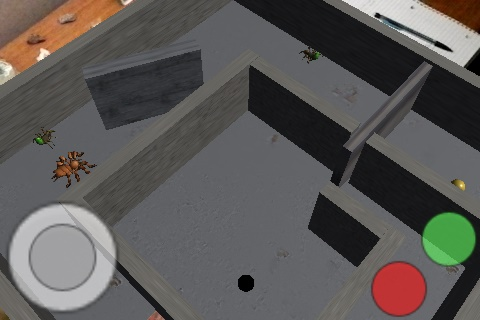

# Springboard #

###### _Last checked with Unity 5.5.4p3_ ######

Springboard is a system for augmented-reality board gaming using tangible interfaces. I created it as an individual course project for Augmented Reality in the spring of 2016. It uses Vuforia Frame Markers, which are no longer supported, so if you build this project, import version 5 of Vuforia first, and then import `Springboard01-Scene.unitypackage`. I wouldn't bother posting Vuforia here, but the official site does not include downloads for older versions despite the fact that some projects still need them. Note that unlike certain other repositories, such as my Unity Tools, I have not directly included the Assets folder from the project. This is because it is too large; instead, I have included the Scripts folder. The rest of the assets may be retrieved by importing `Springboard01-Scene` into a Unity project.

I have achieved tangible interfaces by using the relationships among different Frame Markers. One is the world center, parent to the entire level except for the tangibly controlled virtual elements. One of the other Frame Markers has its position tracked, and the last one has its rotation tracked; the relationships of position and rotation to the world-center marker are used to manipulate the positions and rotations of virtual objects in the scene.

In this example scene, you can manipulate a spinning wall and a sliding wall. The rest of the level serves to show off the tangible interfaces.

If you wish to recreate this example using AR instead of just playing the scene in Unity, use the markers included in the Markers folder with names ending in "bordered", and print each at approximately 4.5 inches squared. The spinning and sliding markers will come out roughly half the width and height of the central one. (For reference, the central marker is #328, the spinner is #50, and the slider is #210.)

While I cleaned up the code a little bit, this is one of my first Unity projects ever. Suffice it to say that the code and the project as a whole could stand to be improved. I have already undertaken some of these improvements in my later work, but those will remain publicly unavailable for the time being.

I have since expanded upon this project to include networking, and I have expanded rotation markers' capabilities to include controlling color. I will publish these eventually but am currently developing them further.

* * *

[_Return to personal portfolio page._](https://iwardlaw.github.io/portfolio)